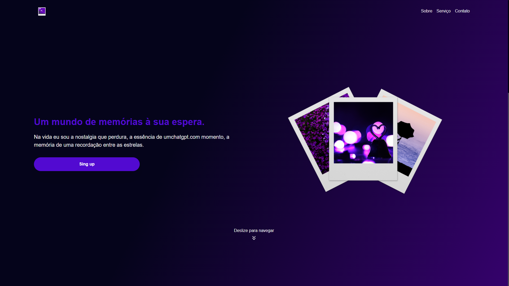

# Stories


---
<div style="display: flex; flex-direction: column; align-items: center; align-content: center; justify-content: center; gap: 0.25rem;">

## Tecnologias Utilizadas

[](https://opensource.org/licenses/MIT)
[](https://www.typescriptlang.org/)
[]()
[]()


</div>

---


## Sobre
O projeto **"Stories"** é uma aplicação desenvolvida por Marlon Mendes, destinada a contar e compartilhar histórias atraves de fotos de uma maneira cativante e envolvente. A plataforma é concebida como um espaço digital para que os usuários compartilhem suas experiências, memórias e reflexões de forma única, utilizando uma variedade de recursos e tecnologias modernas.



--- 

## Execução

<h4>1. Clonagem</h4>
```
git clone https://github.com/marllonmendez/stories.git
```
<h4>2. Instalação das dependências</h4>
```
npm install
```
<h4>3. Build do projeto</h4>
```
vite build
```
<h4>4. Execução local</h4>
```
vite run
```

---

## Licença

Este projeto está licenciado sob a [Licença MIT](LICENSE).
